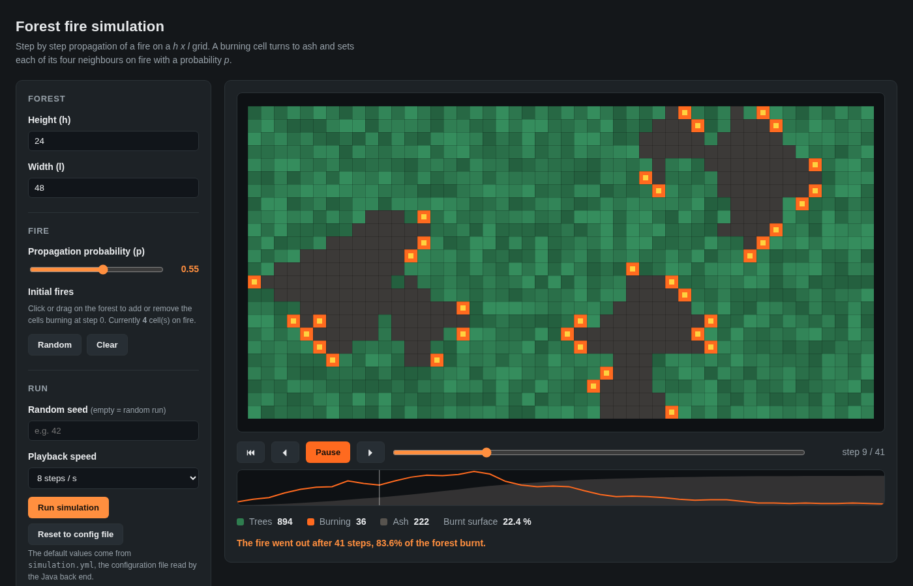

# Forest fire simulation

Step by step simulation of the propagation of a fire in a forest, with a Java back end
(simulation engine, configuration file and REST API) and a TypeScript front end
(interactive visualisation of the run).



## The rules

The forest is a `h x l` grid. Every cell holds a tree, is burning, or is filled with ash.
Time is discrete; if a cell is burning at step `t`, then at step `t + 1`:

* the fire goes out in that cell, which is filled with ash and can never burn again;
* each of its **4 adjacent cells** (no diagonals) catches fire with a probability `p`.

Each adjacent cell is drawn independently, so a tree surrounded by several burning cells gets one
chance per burning neighbour. The simulation stops as soon as no cell is burning any more, which
always happens since a cell burns at most once.

The dimensions of the grid, the cells initially on fire and the probability `p` are parameters of
the program, stored in the configuration file [`backend/src/main/resources/simulation.yml`](backend/src/main/resources/simulation.yml).

## Requirements

* Java 17+ and Maven 3.6+
* Node.js 14+ (only to compile the TypeScript and serve the static files)

## Running the simulation

```bash
# terminal 1 - REST API on http://localhost:8080
cd backend
mvn spring-boot:run

# terminal 2 - front end on http://localhost:5173
cd frontend
npm install
npm start
```

Then open <http://localhost:5173>. The form is prefilled with the values of the configuration file;
click or drag on the forest to choose the cells initially on fire, run the simulation and replay it
step by step (play / pause / previous / next / timeline, space and arrow keys also work). The chart
under the grid shows the number of burning cells and the burnt surface over time.

## Configuration file

```yaml
forest:
  height: 24          # h, number of rows
  width: 48           # l, number of columns

fire:
  propagationProbability: 0.55   # p, probability to spread to each adjacent cell
  initialBurningCells:           # cells on fire at step 0, zero based coordinates
    - { row: 12, column: 8 }
    - { row: 4, column: 36 }

simulation:
  maxSteps: 1000      # safety net, optional
  randomSeed: 42      # optional, set it to replay the exact same run
```

The file is looked up in the working directory first (`./simulation.yml`), then on the classpath, so
the parameters can be changed without rebuilding. `--config=<path>` and the Spring property
`fire.config-file` override that lookup.

Every value is validated: unknown properties (typos), missing properties, a probability outside
`[0, 1]`, empty or out of grid initial fires and non positive dimensions are all rejected with an
explicit message.


